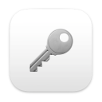

# password-generator 

> This is an application based password-generator written in C# as a Cocoa Mac App. This application provides users the ability to generate passwords with varying customizability. Users can select the password length, whether to include symbols, include numbers, include uppercase/lowercase letters, exclude similar characters, and exclude ambiguous characters. Based on a users desired settings, a password will be generated to fit their needs. A copy to clipboard button is provided as well.

### Installation
> ```
> git clone https://github.com/stevensikorski/password-generator.git
> cd password-generator
> open "Password Generator.app"
> ```

### Demonstration
https://user-images.githubusercontent.com/92190471/210156588-1c478644-df7e-4555-872e-2552e52e44a4.mp4
